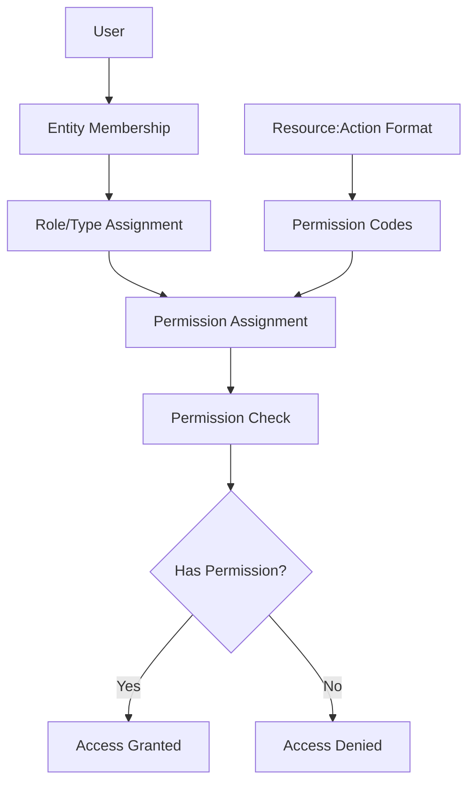
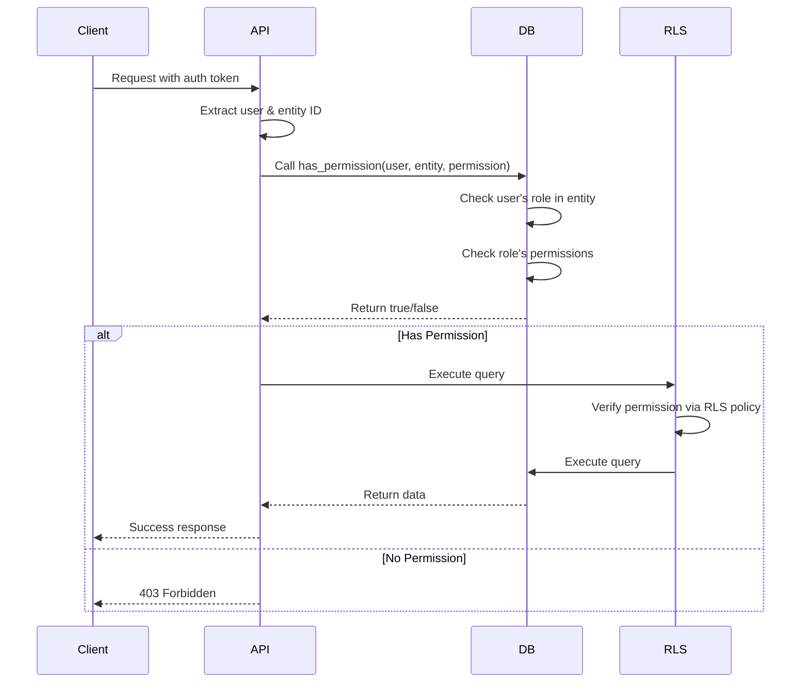

# Permission System Documentation

A comprehensive guide to implementing a Role-Based Access Control (RBAC) system with granular permissions. This document describes the architecture, patterns, and implementation strategies that can be adapted to any project.

## Table of Contents

1. [Overview & Architecture](#overview--architecture)
2. [Database Schema Design](#database-schema-design)
3. [Permission Code System](#permission-code-system)
4. [Backend Implementation Patterns](#backend-implementation-patterns)
5. [Frontend Implementation Patterns](#frontend-implementation-patterns)
6. [Permission Assignment & Management](#permission-assignment--management)
7. [Implementation Guide](#implementation-guide)

---

## Overview & Architecture

### Core Concepts

The permission system follows a **Role-Based Access Control (RBAC)** model with **granular permissions**. Instead of hardcoding role checks throughout the application, permissions are defined as discrete capabilities that can be assigned to roles or user types.

### Architecture Flow



### Key Principles

1. **Granular Permissions**: Instead of checking roles directly, check for specific permissions (e.g., `users:create`, `posts:delete`)
2. **Permission Inheritance**: Permissions are assigned to roles/types, and users inherit permissions through their role assignments
3. **Context-Aware**: Permissions are checked within a specific context (e.g., organization, project, team)
4. **Database-Driven**: Permission checks are performed at the database level for security and consistency
5. **Separation of Concerns**: Permission logic is centralized in database functions and reusable patterns

### Permission Flow

1. **User** belongs to an **Entity** (organization, project, team, etc.)
2. **User** is assigned a **Role/Type** within that entity
3. **Role/Type** has **Permissions** assigned to it
4. When checking access, the system verifies if the user's role has the required permission
5. Permission checks happen at multiple layers:
   - Database level (Row Level Security)
   - API level (route handlers)
   - Frontend level (UI components)

---

## Database Schema Design

### Core Tables

#### 1. Permissions Table

Stores all available permissions in the system.

```sql
CREATE TABLE permissions (
    id UUID PRIMARY KEY DEFAULT uuid_generate_v4(),
    code TEXT NOT NULL UNIQUE,
    name TEXT NOT NULL,
    description TEXT,
    created_at TIMESTAMPTZ DEFAULT NOW(),
    updated_at TIMESTAMPTZ DEFAULT NOW()
);

-- Index for fast lookups
CREATE INDEX idx_permissions_code ON permissions(code);
```

**Fields:**
- `id`: Unique identifier
- `code`: Permission code in `resource:action` format (e.g., `users:create`, `posts:delete`)
- `name`: Human-readable name
- `description`: Optional description of what the permission allows

#### 2. Permission Assignment Table

Many-to-many relationship between roles/types and permissions. This table structure is generic and can be adapted to your specific role/type system.

```sql
-- Generic pattern: entity_type_permissions
CREATE TABLE entity_type_permissions (
    entity_type_id INTEGER NOT NULL,
    permission_id UUID NOT NULL,
    PRIMARY KEY (entity_type_id, permission_id),
    FOREIGN KEY (permission_id) REFERENCES permissions(id) ON DELETE CASCADE
);

-- Index for efficient lookups
CREATE INDEX idx_entity_type_permissions_type ON entity_type_permissions(entity_type_id);
CREATE INDEX idx_entity_type_permissions_permission ON entity_type_permissions(permission_id);
```

**Adaptation Notes:**
- Replace `entity_type` with your specific role/type table name (e.g., `role_permissions`, `user_type_permissions`, `seat_type_permissions`)
- The `entity_type_id` should reference your role/type table

#### 3. User-Entity Membership Table

Tracks which users belong to which entities and their assigned roles/types.

```sql
-- Generic pattern: entity_members
CREATE TABLE entity_members (
    id UUID PRIMARY KEY DEFAULT uuid_generate_v4(),
    user_id UUID NOT NULL,
    entity_id UUID NOT NULL,
    entity_type_id INTEGER NOT NULL, -- References role/type
    created_at TIMESTAMPTZ DEFAULT NOW(),
    updated_at TIMESTAMPTZ DEFAULT NOW(),
    FOREIGN KEY (entity_type_id) REFERENCES entity_types(id),
    UNIQUE(user_id, entity_id) -- One role per user per entity
);

-- Indexes for efficient queries
CREATE INDEX idx_entity_members_user ON entity_members(user_id);
CREATE INDEX idx_entity_members_entity ON entity_members(entity_id);
CREATE INDEX idx_entity_members_user_entity ON entity_members(user_id, entity_id);
```

### Database Function: `has_permission()`

The core function that checks if a user has a specific permission within an entity context.

```sql
CREATE OR REPLACE FUNCTION has_permission(
    p_user_id UUID,
    p_entity_id UUID,
    p_permission_code TEXT
) RETURNS BOOLEAN
LANGUAGE plpgsql
STABLE
SECURITY DEFINER
AS $$
DECLARE
    v_entity_type_id INTEGER;
    v_has_permission BOOLEAN;
BEGIN
    -- Get user's role/type in the entity
    SELECT entity_type_id INTO v_entity_type_id
    FROM entity_members
    WHERE user_id = p_user_id
      AND entity_id = p_entity_id
    LIMIT 1;
    
    -- If user is not a member, deny access
    IF v_entity_type_id IS NULL THEN
        RETURN false;
    END IF;
    
    -- Check if the role/type has the permission
    SELECT EXISTS(
        SELECT 1
        FROM permissions p
        JOIN entity_type_permissions etp ON etp.permission_id = p.id
        WHERE etp.entity_type_id = v_entity_type_id
          AND p.code = p_permission_code
    ) INTO v_has_permission;
    
    RETURN COALESCE(v_has_permission, false);
END;
$$;
```

**Function Parameters:**
- `p_user_id`: The user to check
- `p_entity_id`: The entity context (organization, project, etc.)
- `p_permission_code`: The permission code to check (e.g., `users:create`)

**Returns:** `true` if user has permission, `false` otherwise

**Security:** Uses `SECURITY DEFINER` to run with elevated privileges, allowing it to check permissions even when called from RLS policies.

### Query Pattern for Permission Lookup

The permission lookup follows this pattern:

```sql
-- Get all permissions for a user in an entity
SELECT p.code, p.name, p.description
FROM permissions p
JOIN entity_type_permissions etp ON etp.permission_id = p.id
JOIN entity_members em ON em.entity_type_id = etp.entity_type_id
WHERE em.user_id = :user_id
  AND em.entity_id = :entity_id;
```

---

## Permission Code System

### Naming Convention

Permissions follow a **`resource:action`** format:

```
<resource>:<action>
```

**Examples:**
- `users:create` - Create users
- `users:read` - Read user data
- `users:update` - Update users
- `users:delete` - Delete users
- `posts:create` - Create posts
- `posts:moderate` - Moderate posts
- `settings:update` - Update settings

### Permission Categories

Organize permissions by resource type:

#### User Management
- `users:view` - View user list
- `users:create` - Create new users
- `users:update` - Update user information
- `users:delete` - Delete users
- `users:manage` - Full user management (combines view, create, update, delete)

#### Content Management
- `content:create` - Create content
- `content:edit` - Edit content
- `content:delete` - Delete content
- `content:publish` - Publish content
- `content:moderate` - Moderate content

#### Organization/Entity Management
- `org:view` - View organization details
- `org:update` - Update organization settings
- `org:delete` - Delete organization
- `org:manage` - Full organization management

#### Invitations
- `invites:create` - Create invitations
- `invites:view` - View invitations
- `invites:manage` - Manage invitations (approve/reject)

#### Access Control
- `access:validate` - Validate access (e.g., QR codes, tokens)
- `access:view_history` - View access history
- `access:manage` - Manage access controls

### Adding New Permissions

1. **Define the permission code** following the `resource:action` convention
2. **Insert into permissions table**:
   ```sql
   INSERT INTO permissions (code, name, description)
   VALUES ('new_resource:action', 'Permission Name', 'Description of what this allows');
   ```
3. **Assign to appropriate roles/types** via the assignment table
4. **Update permission checks** in code where needed

### Permission Hierarchy

You can create composite permissions that imply multiple actions:

- `resource:manage` might imply `resource:create`, `resource:update`, `resource:delete`
- `resource:admin` might imply all `resource:*` permissions

**Note:** The system doesn't enforce hierarchy automatically. You can either:
1. Assign all implied permissions explicitly
2. Check for multiple permissions in your code
3. Create a permission hierarchy table and resolve permissions recursively

---

## Backend Implementation Patterns

### API Route Permission Checks

#### Pattern 1: Direct Permission Check

```javascript
// Generic pattern for API route handlers
export async function handler(request, context) {
    // 1. Authenticate user
    const user = await authenticateUser(request);
    if (!user) {
        return unauthorizedResponse();
    }
    
    // 2. Extract entity ID from request
    const entityId = extractEntityId(request); // From URL params, body, etc.
    
    // 3. Check permission using database function
    const hasPermission = await checkPermission(
        user.id,
        entityId,
        'resource:action'
    );
    
    if (!hasPermission) {
        return forbiddenResponse('You do not have permission to perform this action');
    }
    
    // 4. Proceed with the operation
    return performOperation();
}
```

#### Pattern 2: Using Database RPC

```javascript
// Example using Supabase/PostgreSQL
const { data: hasPermission, error } = await supabase.rpc('has_permission', {
    p_user_id: user.id,
    p_entity_id: entityId,
    p_permission_code: 'resource:action'
});

if (error || !hasPermission) {
    return NextResponse.json(
        { error: true, message: 'Permission denied' },
        { status: 403 }
    );
}
```

#### Pattern 3: Reusable Permission Middleware

```javascript
// Generic middleware pattern
function requirePermission(permissionCode) {
    return async (request, context) => {
        const user = await authenticateUser(request);
        const entityId = extractEntityId(request);
        
        const hasPermission = await checkPermission(
            user.id,
            entityId,
            permissionCode
        );
        
        if (!hasPermission) {
            throw new PermissionDeniedError(permissionCode);
        }
        
        return { user, entityId };
    };
}

// Usage
export async function DELETE(request, { params }) {
    const { user, entityId } = await requirePermission('resource:delete')(
        request,
        { params }
    );
    
    // Proceed with deletion
}
```

### Row Level Security (RLS) Policies

RLS policies use the `has_permission()` function to enforce access at the database level.

#### Pattern: Permission-Based RLS Policy

```sql
-- Generic RLS policy pattern
CREATE POLICY "policy_name" ON table_name
FOR operation -- SELECT, INSERT, UPDATE, DELETE
TO authenticated
USING (
    has_permission(
        auth.uid(),           -- Current user ID
        entity_id,            -- Entity ID from the row
        'resource:action'     -- Required permission
    )
);
```

#### Example: Resource Table with Permission Checks

```sql
-- Example: posts table
CREATE POLICY "Users with posts:create can create posts"
ON posts
FOR INSERT
TO authenticated
WITH CHECK (
    has_permission(
        auth.uid(),
        organization_id,  -- Entity context
        'posts:create'
    )
);

CREATE POLICY "Users with posts:read can view posts"
ON posts
FOR SELECT
TO authenticated
USING (
    has_permission(
        auth.uid(),
        organization_id,
        'posts:read'
    )
);

CREATE POLICY "Users with posts:update can update posts"
ON posts
FOR UPDATE
TO authenticated
USING (
    has_permission(
        auth.uid(),
        organization_id,
        'posts:update'
    )
);
```

### Error Handling

Standardize error responses for permission failures:

```javascript
// Permission error response pattern
function permissionDeniedResponse(permissionCode, resource = null) {
    return {
        error: true,
        message: `You do not have permission to ${getActionDescription(permissionCode)}${resource ? ` ${resource}` : ''}`,
        code: 'PERMISSION_DENIED',
        required_permission: permissionCode,
        status: 403
    };
}

// Usage
if (!hasPermission) {
    return NextResponse.json(
        permissionDeniedResponse('users:delete', 'this user'),
        { status: 403 }
    );
}
```

### Standard Permission Check Workflow



---

## Frontend Implementation Patterns

### Permission Context/Provider Pattern

Create a context that provides permission checking capabilities throughout the application.

```javascript
// Generic permission context pattern
import { createContext, useContext, useState, useEffect } from 'react';

const PermissionContext = createContext(null);

export function PermissionProvider({ children, entityId, userId }) {
    const [permissions, setPermissions] = useState([]);
    const [loading, setLoading] = useState(true);
    
    useEffect(() => {
        if (!entityId || !userId) {
            setLoading(false);
            return;
        }
        
        // Fetch user's permissions for this entity
        fetchPermissions(entityId, userId)
            .then(setPermissions)
            .finally(() => setLoading(false));
    }, [entityId, userId]);
    
    const hasPermission = (permissionCode) => {
        return permissions.includes(permissionCode);
    };
    
    return (
        <PermissionContext.Provider value={{ permissions, hasPermission, loading }}>
            {children}
        </PermissionContext.Provider>
    );
}

export function usePermissions() {
    const context = useContext(PermissionContext);
    if (!context) {
        throw new Error('usePermissions must be used within PermissionProvider');
    }
    return context;
}
```

### Custom Hook for Permission Checks

```javascript
// Generic permission hook
export function usePermission(permissionCode) {
    const { hasPermission, loading } = usePermissions();
    
    return {
        hasPermission: hasPermission(permissionCode),
        loading
    };
}

// Usage in components
function DeleteButton({ resourceId }) {
    const { hasPermission, loading } = usePermission('resource:delete');
    
    if (loading) return <Spinner />;
    if (!hasPermission) return null;
    
    return <Button onClick={() => deleteResource(resourceId)}>Delete</Button>;
}
```

### Menu/Navigation Filtering

Filter menu items based on permissions:

```javascript
// Generic menu filtering pattern
const MENU_ITEMS = [
    { key: 'users', path: '/users', permission: 'users:view' },
    { key: 'settings', path: '/settings', permission: 'settings:view' },
    { key: 'reports', path: '/reports', permission: 'reports:view' },
];

export function getFilteredMenuItems(permissions) {
    return MENU_ITEMS.filter(item => {
        // If no permission required, show to all
        if (!item.permission) return true;
        // Otherwise, check if user has the permission
        return permissions.includes(item.permission);
    });
}

// Usage
function Navigation() {
    const { permissions } = usePermissions();
    const menuItems = getFilteredMenuItems(permissions);
    
    return (
        <nav>
            {menuItems.map(item => (
                <Link key={item.key} to={item.path}>{item.label}</Link>
            ))}
        </nav>
    );
}
```

### Component-Level Permission Checks

```javascript
// Pattern 1: Conditional rendering
function ResourceList() {
    const { hasPermission } = usePermissions();
    const canCreate = hasPermission('resource:create');
    const canDelete = hasPermission('resource:delete');
    
    return (
        <div>
            {canCreate && <CreateButton />}
            <ResourceItems />
            {canDelete && <DeleteButtons />}
        </div>
    );
}

// Pattern 2: Protected component wrapper
function ProtectedComponent({ permission, children, fallback = null }) {
    const { hasPermission } = usePermissions();
    
    if (!hasPermission(permission)) {
        return fallback;
    }
    
    return children;
}

// Usage
<ProtectedComponent permission="admin:access" fallback={<AccessDenied />}>
    <AdminPanel />
</ProtectedComponent>
```

### Route Protection

```javascript
// Generic route protection pattern
function ProtectedRoute({ permission, children }) {
    const { hasPermission, loading } = usePermissions();
    const navigate = useNavigate();
    
    useEffect(() => {
        if (!loading && !hasPermission(permission)) {
            navigate('/unauthorized');
        }
    }, [loading, hasPermission, permission, navigate]);
    
    if (loading) return <LoadingSpinner />;
    if (!hasPermission(permission)) return null;
    
    return children;
}

// Usage in router
<Route
    path="/admin"
    element={
        <ProtectedRoute permission="admin:access">
            <AdminPage />
        </ProtectedRoute>
    }
/>
```

### Permission Checking Patterns in UI Components

```javascript
// Pattern 1: Show/hide based on permission
function ActionBar() {
    const { hasPermission } = usePermissions();
    
    return (
        <div>
            {hasPermission('resource:edit') && <EditButton />}
            {hasPermission('resource:delete') && <DeleteButton />}
            {hasPermission('resource:share') && <ShareButton />}
        </div>
    );
}

// Pattern 2: Disable instead of hide
function ActionBar() {
    const { hasPermission } = usePermissions();
    
    return (
        <div>
            <EditButton disabled={!hasPermission('resource:edit')} />
            <DeleteButton disabled={!hasPermission('resource:delete')} />
        </div>
    );
}

// Pattern 3: Show tooltip for disabled actions
function ActionBar() {
    const { hasPermission } = usePermissions();
    
    return (
        <Tooltip content={!hasPermission('resource:delete') ? 'Permission required' : ''}>
            <DeleteButton disabled={!hasPermission('resource:delete')} />
        </Tooltip>
    );
}
```

---

## Permission Assignment & Management

### Assigning Permissions to Roles/Types

#### Manual Assignment

```sql
-- Assign a permission to a role/type
INSERT INTO entity_type_permissions (entity_type_id, permission_id)
VALUES (
    (SELECT id FROM entity_types WHERE name = 'admin'),
    (SELECT id FROM permissions WHERE code = 'users:manage')
);
```

#### Bulk Assignment

```sql
-- Assign multiple permissions to a role/type
INSERT INTO entity_type_permissions (entity_type_id, permission_id)
SELECT 
    (SELECT id FROM entity_types WHERE name = 'admin'),
    id
FROM permissions
WHERE code IN ('users:create', 'users:update', 'users:delete', 'users:view');
```

### Permission Management Workflows

#### 1. Creating a New Role with Permissions

```sql
-- 1. Create the role/type
INSERT INTO entity_types (name, description)
VALUES ('moderator', 'Can moderate content');

-- 2. Assign permissions
INSERT INTO entity_type_permissions (entity_type_id, permission_id)
SELECT 
    (SELECT id FROM entity_types WHERE name = 'moderator'),
    id
FROM permissions
WHERE code IN (
    'content:read',
    'content:moderate',
    'users:read'
);
```

#### 2. Adding Permissions to Existing Role

```sql
-- Add new permission to existing role
INSERT INTO entity_type_permissions (entity_type_id, permission_id)
SELECT 
    et.id,
    p.id
FROM entity_types et
CROSS JOIN permissions p
WHERE et.name = 'editor'
  AND p.code = 'content:publish'
  AND NOT EXISTS (
      SELECT 1 FROM entity_type_permissions etp
      WHERE etp.entity_type_id = et.id
        AND etp.permission_id = p.id
  );
```

#### 3. Removing Permissions from Role

```sql
-- Remove permission from role
DELETE FROM entity_type_permissions
WHERE entity_type_id = (SELECT id FROM entity_types WHERE name = 'editor')
  AND permission_id = (SELECT id FROM permissions WHERE code = 'content:delete');
```

### Default Permission Sets

Define common permission sets for quick assignment:

```sql
-- Create a view or function for common permission sets
CREATE OR REPLACE FUNCTION assign_default_permissions(
    p_role_name TEXT,
    p_permission_set TEXT
) RETURNS VOID AS $$
DECLARE
    v_role_id INTEGER;
    v_permissions TEXT[];
BEGIN
    -- Get role ID
    SELECT id INTO v_role_id
    FROM entity_types
    WHERE name = p_role_name;
    
    -- Define permission sets
    CASE p_permission_set
        WHEN 'admin' THEN
            v_permissions := ARRAY[
                'users:manage',
                'content:manage',
                'settings:manage',
                'org:manage'
            ];
        WHEN 'editor' THEN
            v_permissions := ARRAY[
                'content:create',
                'content:edit',
                'content:publish'
            ];
        WHEN 'viewer' THEN
            v_permissions := ARRAY[
                'content:read',
                'users:read'
            ];
    END CASE;
    
    -- Assign permissions
    INSERT INTO entity_type_permissions (entity_type_id, permission_id)
    SELECT v_role_id, p.id
    FROM permissions p
    WHERE p.code = ANY(v_permissions)
    ON CONFLICT DO NOTHING;
END;
$$ LANGUAGE plpgsql;
```

### Dynamic Permission Assignment

For systems that allow runtime permission management:

```javascript
// Generic API endpoint for permission management
export async function assignPermission(roleId, permissionCode) {
    const permission = await getPermissionByCode(permissionCode);
    
    await db.insert('entity_type_permissions', {
        entity_type_id: roleId,
        permission_id: permission.id
    });
}

export async function revokePermission(roleId, permissionCode) {
    const permission = await getPermissionByCode(permissionCode);
    
    await db.delete('entity_type_permissions', {
        entity_type_id: roleId,
        permission_id: permission.id
    });
}
```

### Permission Inheritance Patterns

#### Pattern 1: Explicit Inheritance

Create a hierarchy table and resolve permissions recursively:

```sql
CREATE TABLE permission_inheritance (
    parent_permission_id UUID NOT NULL,
    child_permission_id UUID NOT NULL,
    PRIMARY KEY (parent_permission_id, child_permission_id),
    FOREIGN KEY (parent_permission_id) REFERENCES permissions(id),
    FOREIGN KEY (child_permission_id) REFERENCES permissions(id)
);

-- Example: users:manage inherits users:create, users:update, users:delete
INSERT INTO permission_inheritance VALUES
    ((SELECT id FROM permissions WHERE code = 'users:manage'),
     (SELECT id FROM permissions WHERE code = 'users:create')),
    ((SELECT id FROM permissions WHERE code = 'users:manage'),
     (SELECT id FROM permissions WHERE code = 'users:update'));
```

#### Pattern 2: Composite Permission Checks

In your application code, check for composite permissions:

```javascript
function hasPermissionOrComposite(permissionCode) {
    const compositeMap = {
        'users:manage': ['users:create', 'users:update', 'users:delete', 'users:view'],
        'content:manage': ['content:create', 'content:edit', 'content:delete', 'content:publish']
    };
    
    const { hasPermission } = usePermissions();
    
    // Check the composite permission first
    if (hasPermission(permissionCode)) {
        return true;
    }
    
    // Check if any of the component permissions are granted
    const components = compositeMap[permissionCode] || [];
    return components.some(perm => hasPermission(perm));
}
```

---

## Implementation Guide

### Step 1: Database Schema Setup

1. **Create permissions table**:
   ```sql
   CREATE TABLE permissions (
       id UUID PRIMARY KEY DEFAULT uuid_generate_v4(),
       code TEXT NOT NULL UNIQUE,
       name TEXT NOT NULL,
       description TEXT,
       created_at TIMESTAMPTZ DEFAULT NOW()
   );
   ```

2. **Create permission assignment table** (adapt to your role/type system):
   ```sql
   CREATE TABLE entity_type_permissions (
       entity_type_id INTEGER NOT NULL,
       permission_id UUID NOT NULL,
       PRIMARY KEY (entity_type_id, permission_id)
   );
   ```

3. **Create the `has_permission()` function** (adapt table names to your schema):
   ```sql
   CREATE OR REPLACE FUNCTION has_permission(
       p_user_id UUID,
       p_entity_id UUID,
       p_permission_code TEXT
   ) RETURNS BOOLEAN AS $$
   -- Implementation from Database Schema Design section
   $$;
   ```

### Step 2: Seed Initial Permissions

```sql
-- Insert core permissions
INSERT INTO permissions (code, name, description) VALUES
    ('users:view', 'View Users', 'View list of users'),
    ('users:create', 'Create Users', 'Create new users'),
    ('users:update', 'Update Users', 'Update user information'),
    ('users:delete', 'Delete Users', 'Delete users'),
    ('content:create', 'Create Content', 'Create new content'),
    ('content:edit', 'Edit Content', 'Edit existing content'),
    ('content:delete', 'Delete Content', 'Delete content');
```

### Step 3: Assign Permissions to Roles

```sql
-- Assign permissions to admin role
INSERT INTO entity_type_permissions (entity_type_id, permission_id)
SELECT 
    (SELECT id FROM entity_types WHERE name = 'admin'),
    id
FROM permissions;
```

### Step 4: Set Up Row Level Security

```sql
-- Enable RLS on your tables
ALTER TABLE your_table ENABLE ROW LEVEL SECURITY;

-- Create RLS policies using has_permission()
CREATE POLICY "users_with_permission_can_access"
ON your_table
FOR SELECT
TO authenticated
USING (
    has_permission(
        auth.uid(),
        entity_id,
        'resource:read'
    )
);
```

### Step 5: Implement Backend Permission Checks

1. **Create permission check utility**:
   ```javascript
   async function checkPermission(userId, entityId, permissionCode) {
       // Call your database function
       const result = await db.rpc('has_permission', {
           p_user_id: userId,
           p_entity_id: entityId,
           p_permission_code: permissionCode
       });
       return result;
   }
   ```

2. **Add permission checks to API routes**:
   ```javascript
   export async function POST(request) {
       const user = await authenticate(request);
       const entityId = extractEntityId(request);
       
       const hasPermission = await checkPermission(
           user.id,
           entityId,
           'resource:create'
       );
       
       if (!hasPermission) {
           return forbidden();
       }
       
       // Proceed with creation
   }
   ```

### Step 6: Implement Frontend Permission System

1. **Create permission context/provider**:
   ```javascript
   // Use the pattern from Frontend Implementation Patterns section
   ```

2. **Create permission hooks**:
   ```javascript
   // Use the patterns from Frontend Implementation Patterns section
   ```

3. **Add permission checks to components**:
   ```javascript
   // Use conditional rendering patterns
   ```

### Step 7: Testing Strategies

#### Unit Tests

```javascript
describe('Permission System', () => {
    it('should grant access when user has permission', async () => {
        const hasPermission = await checkPermission(
            userId,
            entityId,
            'resource:read'
        );
        expect(hasPermission).toBe(true);
    });
    
    it('should deny access when user lacks permission', async () => {
        const hasPermission = await checkPermission(
            userId,
            entityId,
            'resource:admin'
        );
        expect(hasPermission).toBe(false);
    });
});
```

#### Integration Tests

```javascript
describe('API Permission Checks', () => {
    it('should return 403 for unauthorized requests', async () => {
        const response = await request(app)
            .post('/api/resource')
            .set('Authorization', `Bearer ${userToken}`)
            .send({ data: 'test' });
        
        expect(response.status).toBe(403);
    });
});
```

#### RLS Policy Tests

```sql
-- Test RLS policies
BEGIN;
SET LOCAL ROLE authenticated;
SET LOCAL request.jwt.claim.sub = 'test-user-id';

-- Should return rows if user has permission
SELECT * FROM your_table WHERE entity_id = 'test-entity';

-- Should return empty if user lacks permission
SELECT * FROM your_table WHERE entity_id = 'test-entity';

ROLLBACK;
```

### Common Pitfalls and Solutions

#### 1. Forgetting to Check Permissions in Multiple Layers

**Problem**: Only checking permissions in frontend, leaving backend vulnerable.

**Solution**: Always check permissions at:
- Database level (RLS policies)
- API level (route handlers)
- Frontend level (UI components)

#### 2. Not Caching Permission Lookups

**Problem**: Making database calls for every permission check can be slow.

**Solution**: Cache user permissions in memory or Redis:
```javascript
const permissionCache = new Map();

async function getCachedPermissions(userId, entityId) {
    const key = `${userId}:${entityId}`;
    if (permissionCache.has(key)) {
        return permissionCache.get(key);
    }
    
    const permissions = await fetchPermissions(userId, entityId);
    permissionCache.set(key, permissions);
    return permissions;
}
```

#### 3. Permission Code Typos

**Problem**: Typos in permission codes cause silent failures.

**Solution**: Use constants or enums:
```javascript
const PERMISSIONS = {
    USERS_CREATE: 'users:create',
    USERS_UPDATE: 'users:update',
    USERS_DELETE: 'users:delete',
} as const;

// Usage
hasPermission(PERMISSIONS.USERS_CREATE);
```

#### 4. Not Handling Permission Changes Gracefully

**Problem**: User permissions change but frontend still shows old permissions.

**Solution**: Implement permission refresh mechanism:
```javascript
function usePermissions() {
    const [permissions, setPermissions] = useState([]);
    
    const refreshPermissions = useCallback(() => {
        fetchPermissions().then(setPermissions);
    }, []);
    
    // Refresh on entity change or manual trigger
    useEffect(() => {
        refreshPermissions();
    }, [entityId, refreshPermissions]);
    
    return { permissions, refreshPermissions };
}
```

#### 5. Overly Broad Permissions

**Problem**: Creating permissions like `admin:all` defeats the purpose of granular permissions.

**Solution**: Use composite permissions or permission sets instead:
```javascript
// Instead of 'admin:all'
const ADMIN_PERMISSIONS = [
    'users:manage',
    'content:manage',
    'settings:manage'
];
```

### Adapting to Different Frameworks and Databases

#### PostgreSQL (Current Implementation)

The patterns shown use PostgreSQL. The `has_permission()` function uses PostgreSQL-specific syntax.

#### MySQL/MariaDB

Adapt the function syntax:
```sql
DELIMITER //
CREATE FUNCTION has_permission(
    p_user_id VARCHAR(36),
    p_entity_id VARCHAR(36),
    p_permission_code VARCHAR(100)
) RETURNS BOOLEAN
READS SQL DATA
DETERMINISTIC
BEGIN
    DECLARE v_entity_type_id INT;
    DECLARE v_has_permission BOOLEAN DEFAULT FALSE;
    
    SELECT entity_type_id INTO v_entity_type_id
    FROM entity_members
    WHERE user_id = p_user_id
      AND entity_id = p_entity_id
    LIMIT 1;
    
    IF v_entity_type_id IS NULL THEN
        RETURN FALSE;
    END IF;
    
    SELECT EXISTS(
        SELECT 1
        FROM permissions p
        JOIN entity_type_permissions etp ON etp.permission_id = p.id
        WHERE etp.entity_type_id = v_entity_type_id
          AND p.code = p_permission_code
    ) INTO v_has_permission;
    
    RETURN v_has_permission;
END//
DELIMITER ;
```

#### MongoDB

Use aggregation pipelines:
```javascript
async function hasPermission(userId, entityId, permissionCode) {
    const result = await db.collection('entity_members').aggregate([
        { $match: { user_id: userId, entity_id: entityId } },
        { $lookup: {
            from: 'entity_type_permissions',
            localField: 'entity_type_id',
            foreignField: 'entity_type_id',
            as: 'permissions'
        }},
        { $unwind: '$permissions' },
        { $lookup: {
            from: 'permissions',
            localField: 'permissions.permission_id',
            foreignField: '_id',
            as: 'permission'
        }},
        { $unwind: '$permission' },
        { $match: { 'permission.code': permissionCode } },
        { $limit: 1 }
    ]).toArray();
    
    return result.length > 0;
}
```

#### Different Frontend Frameworks

**React**: Use the patterns shown in this document.

**Vue.js**: Adapt the context pattern to Vue's provide/inject:
```javascript
export default {
    provide() {
        return {
            hasPermission: (code) => this.permissions.includes(code)
        };
    }
};
```

**Angular**: Use services and guards:
```typescript
@Injectable()
export class PermissionService {
    hasPermission(code: string): boolean {
        return this.permissions.includes(code);
    }
}

@Injectable()
export class PermissionGuard implements CanActivate {
    canActivate(route: ActivatedRouteSnapshot): boolean {
        const permission = route.data['permission'];
        return this.permissionService.hasPermission(permission);
    }
}
```

---

## Conclusion

This permission system provides a flexible, scalable approach to access control that can be adapted to any project. Key takeaways:

1. **Granular permissions** are more flexible than role-only checks
2. **Database-level checks** ensure security even if application code has bugs
3. **Consistent patterns** make the system easier to understand and maintain
4. **Framework-agnostic design** allows adaptation to different tech stacks

Remember to:
- Always check permissions at multiple layers (database, API, frontend)
- Use consistent naming conventions for permission codes
- Cache permission lookups for performance
- Test permission checks thoroughly
- Document permission requirements for each feature

For questions or improvements to this system, refer to your project's specific implementation or adapt these patterns to your needs.
